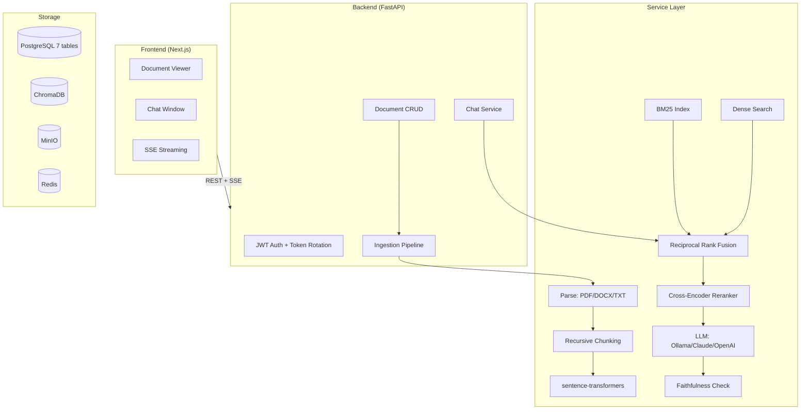

# Veridoc — Chat With Your Documents

> Upload documents, ask questions in plain English, get answers grounded in and cited to the exact source passage — with no hallucination and zero cloud dependency required to run.

[](https://python.org)
[](https://nextjs.org)
[](https://postgresql.org)
[](LICENSE)
[](#testing)
[](#security)

---

## Table of Contents

- [1. Executive Summary](#1-executive-summary)
- [2. Tech Stack & Core Technologies](#2-tech-stack--core-technologies)
- [3. High-Level Architecture](#3-high-level-architecture)
- [4. Complete Folder Structure Tree](#4-complete-folder-structure-tree)
- [5. Exhaustive File-by-File & Folder-by-Folder Breakdown](#5-exhaustive-file-by-file--folder-by-folder-breakdown)
- [6. Data Models & Schemas](#6-data-models--schemas)
- [7. API Surface](#7-api-surface)
- [8. Configuration & Environment Variables](#8-configuration--environment-variables)
- [9. Build, Run & Deployment Instructions](#9-build-run--deployment-instructions)
- [10. Data & Control Flow Walkthroughs](#10-data--control-flow-walkthroughs)
- [11. Dependency Graph Summary](#11-dependency-graph-summary)
- [12. Testing Strategy](#12-testing-strategy)
- [13. Known Issues, Technical Debt & Assumptions](#13-known-issues-technical-debt--assumptions)
- [14. Glossary](#14-glossary)
- [15. Appendix](#15-appendix)

---

## 1. Executive Summary

**Veridoc** is a chat-with-your-documents RAG (Retrieval Augmented Generation) application that runs 100% locally — no cloud accounts, no API keys required. Upload documents (PDF, DOCX, TXT), ask questions in plain English, and get answers grounded in actual source passages with clickable citations.

**Target users**: Knowledge workers, researchers, legal professionals, and anyone who needs to search and query document collections.

**What it solves**: Knowledge workers spend ~20% of their time searching for information across documents. Existing solutions either send sensitive docs to third-party APIs, hallucinate plausible-sounding falsehoods, or provide opaque answers without citations.

**Why it exists**: To demonstrate a production-ready RAG application with hybrid retrieval (BM25 + dense + RRF + cross-encoder reranking), security hardening, and a genuine engineering journey documented through before/after audit results.

*Note: The hybrid retrieval architecture, security hardening, and audit story (5.8 → 8.3/10) are explicitly documented in the README.*

---

## 2. Tech Stack & Core Technologies

| Layer | Technology | Version | Purpose |
|-------|-----------|---------|---------|
| Language | Python | 3.12+ | Backend |
| API Framework | FastAPI | — | REST API + SSE streaming |
| ORM | SQLAlchemy | 2.0+ | Database access |
| Migrations | Alembic | — | Schema versioning |
| Frontend | Next.js | 14 | App Router SPA |
| TypeScript | — | — | Type-safe frontend |
| Styling | Tailwind CSS | — | Utility-first CSS |
| State | Zustand | — | Client state |
| Database | PostgreSQL | 16 | 7 normalized tables |
| Vector DB | ChromaDB | — | Local-first vector storage |
| LLM | Ollama (default) | — | Local LLM inference |
| Embeddings | sentence-transformers | all-MiniLM-L6-v2 | 384-dim embeddings |
| Reranker | cross-encoder | ms-marco-MiniLM-L-6-v2 | Precision reranking |
| Search | BM25 + Dense + RRF | — | Hybrid retrieval |
| OCR | Tesseract | — | Scanned PDF fallback |
| Queue | ARQ + Redis | — | Background ingestion |
| Monitoring | Prometheus + structlog | — | Metrics + structured logging |
| Auth | JWT + bcrypt | — | Authentication |
| Encryption | Fernet | — | Files encrypted at rest |
| Container | Docker + docker-compose | — | One-command deployment |

---

## 3. High-Level Architecture



---

## 4. Complete Folder Structure Tree

```
Veridoc/
├── .dockerignore
├── .github/
│   ├── dependabot.yml
│   └── workflows/
│       ├── ci.yml
│       └── dependabot-auto-merge.yml
├── .gitignore
├── .trivyignore
├── AGENTS.md
├── backend/
│   ├── alembic/
│   │   ├── env.py
│   │   ├── script.py.mako
│   │   └── versions/
│   │       ├── 001_initial_schema.py
│   │       ├── 002_normalize_arrays_and_json.py
│   │       ├── 003_add_chunk_ocr_used.py
│   │       ├── 004_rbac_audit_indexes_sharing.py
│   │       └── 005_add_verification_token_expiry.py
│   ├── alembic.ini
│   ├── app/
│   │   ├── __init__.py
│   │   ├── api/
│   │   │   ├── admin.py
│   │   │   ├── api_keys.py
│   │   │   ├── auth.py
│   │   │   ├── chat.py
│   │   │   ├── documents.py
│   │   │   ├── feedback.py
│   │   │   ├── gdpr.py
│   │   │   ├── search.py
│   │   │   ├── sharing.py
│   │   │   └── __init__.py
│   │   ├── core/
│   │   │   ├── config.py
│   │   │   ├── database.py
│   │   │   ├── dependencies.py
│   │   │   ├── di.py
│   │   │   ├── logging_config.py
│   │   │   ├── rate_limit.py
│   │   │   ├── security.py
│   │   │   ├── token_store.py
│   │   │   └── __init__.py
│   │   ├── main.py
│   │   ├── models/
│   │   │   ├── admin_audit_log.py
│   │   │   ├── api_key.py
│   │   │   ├── chunk.py
│   │   │   ├── citation_record.py
│   │   │   ├── conversation.py
│   │   │   ├── conversation_document.py
│   │   │   ├── document.py
│   │   │   ├── document_share.py
│   │   │   ├── message.py
│   │   │   ├── usage_log.py
│   │   │   ├── user.py
│   │   │   └── __init__.py
│   │   ├── repositories/
│   │   │   ├── base.py
│   │   │   ├── chunk_repo.py
│   │   │   ├── conversation_repo.py
│   │   │   ├── document_repo.py
│   │   │   ├── usage_log_repo.py
│   │   │   ├── user_repo.py
│   │   │   └── __init__.py
│   │   ├── schemas/
│   │   │   ├── api_key.py
│   │   │   ├── auth.py
│   │   │   ├── base.py
│   │   │   ├── chat.py
│   │   │   ├── document.py
│   │   │   ├── sharing.py
│   │   │   └── __init__.py
│   │   └── services/
│   │       ├── chat_service.py
│   │       ├── chunking.py
│   │       ├── email_sender.py
│   │       ├── evaluation.py
│   │       ├── ingestion.py
│   │       ├── job_queue.py
│   │       ├── llm_provider.py
│   │       ├── prompt_registry.py
│   │       ├── response_cache.py
│   │       ├── retrieval/
│   │       │   ├── bm25.py
│   │       │   ├── dense.py
│   │       │   ├── hybrid.py
│   │       │   ├── query_rewrite.py
│   │       │   ├── rrf.py
│   │       │   └── __init__.py
│   │       ├── ssrf_protection.py
│   │       ├── vector_store.py
│   │       └── worker.py
│   ├── Dockerfile
│   ├── requirements.txt
│   └── tests/
│       ├── conftest.py
│       └── test_*.py               # 77 tests
├── BUILD_LOG.md
├── data/
│   └── documents/
│       ├── github_readme.md
│       ├── gutenberg_132.txt
│       └── synthetic_contract.txt
├── docker-compose.prod.yml
├── docker-compose.yml
├── docs/
│   ├── community/
│   ├── decisions/
│   ├── design/
│   ├── product/
│   ├── project/
│   ├── reference/
│   │   ├── audit-before-after.md
│   │   ├── deployment-runbook.md
│   │   └── Glossary.md
│   └── technical/
│       ├── API.md
│       ├── Deployment.md
│       ├── Schema.md
│       ├── security-notes.md
│       ├── SecurityAndCompliance.md
│       ├── TechSpec.md
│       └── Testing.md
├── eval/
│   ├── gold_qa.json
│   └── red_team/
│       └── prompt_injection.json
├── frontend/
│   ├── .eslintrc.json
│   ├── Dockerfile
│   ├── e2e/
│   │   ├── smoke.spec.ts
│   │   └── visual.spec.ts
│   ├── next.config.js
│   ├── package.json
│   ├── playwright.config.ts
│   ├── postcss.config.js
│   ├── scripts/generate-types.mjs
│   ├── src/
│   │   ├── app/
│   │   │   ├── admin/page.tsx
│   │   │   ├── dashboard/page.tsx
│   │   │   ├── globals.css
│   │   │   ├── layout.tsx
│   │   │   ├── login/page.tsx
│   │   │   ├── page.tsx
│   │   │   └── register/page.tsx
│   │   ├── components/
│   │   │   ├── AuthProvider.tsx
│   │   │   ├── ChatPanel.tsx
│   │   │   ├── CommandPalette.tsx
│   │   │   ├── ConfidenceBadge.tsx
│   │   │   ├── DocumentList.tsx
│   │   │   ├── DocumentViewer.tsx
│   │   │   ├── ErrorBoundary.tsx
│   │   │   ├── OCRBadge.tsx
│   │   │   ├── QueryProvider.tsx
│   │   │   ├── SearchBar.tsx
│   │   │   ├── Skeleton.tsx
│   │   │   ├── ThemeToggle.tsx
│   │   │   ├── ThumbsUpDown.tsx
│   │   │   ├── Toast.tsx
│   │   │   └── __tests__/
│   │   ├── lib/
│   │   │   ├── api-types.ts
│   │   │   ├── api.ts
│   │   │   ├── i18n.ts
│   │   │   ├── queries.ts
│   │   │   ├── store.ts
│   │   │   ├── toast-store.ts
│   │   │   ├── utils.ts
│   │   │   └── __tests__/
│   │   ├── middleware.ts
│   │   └── test/setup.ts
│   ├── tailwind.config.ts
│   ├── tsconfig.json
│   └── vitest.config.ts
├── LICENSE
├── LOOP_LOG.md
├── Makefile
├── PROJECT_ANALYSIS.md
├── PROJECT_OVERVIEW.md
├── prompts/registry.json
├── pyproject.toml
├── README.md
└── scripts/
    ├── benchmark_reranker.py
    ├── build_gold_qa.py
    ├── chaos_test_live.py
    ├── ci_eval_gate.py
    ├── download_squad.py
    ├── fetch_eval_data.py
    ├── locustfile.py
    ├── promote_feedback.py
    ├── run_eval.py
    ├── run_load_test.py
    ├── run_redteam_live.py
    ├── run_standalone_eval.py
    └── tune_hybrid_weights.py
```

---

## 5. Exhaustive File-by-File & Folder-by-Folder Breakdown

### Backend Core

#### `backend/app/main.py`
- **Purpose**: FastAPI application with JWT auth, rate limiting, CORS, security headers, and startup validation.

#### `backend/app/services/ingestion.py`
- **Purpose**: Document ingestion pipeline — parse → chunk → embed → index to ChromaDB + persist metadata to Postgres.

#### `backend/app/services/retrieval/hybrid.py`
- **Purpose**: Hybrid search combining BM25 (keyword) + dense vectors merged via Reciprocal Rank Fusion.

#### `backend/app/services/retrieval/rrf.py`
- **Purpose**: Reciprocal Rank Fusion algorithm for merging ranked lists.

#### `backend/app/services/retrieval/query_rewrite.py`
- **Purpose**: LLM rewrites vague follow-ups into standalone queries.

#### `backend/app/services/chat_service.py`
- **Purpose**: Chat service with SSE streaming, citation generation, and faithfulness checking.

#### `backend/app/services/llm_provider.py`
- **Purpose**: Pluggable LLM provider (Ollama default, Claude/OpenAI optional).

#### `backend/app/core/security.py`
- **Purpose**: JWT auth with token rotation, bcrypt hashing, and startup validation.

#### `backend/app/core/di.py`
- **Purpose**: Constructor injection DI container replacing global singletons.

---

## 6. Data Models & Schemas

### Document

```json
{
  "id": "uuid",
  "user_id": "uuid — FK to User",
  "filename": "str",
  "file_type": "str — pdf/docx/txt",
  "status": "str — processing/ready/error",
  "chunk_count": "int",
  "created_at": "datetime"
}
```

### Chunk

```json
{
  "id": "uuid",
  "document_id": "uuid — FK to Document",
  "content": "str — text chunk",
  "page_number": "int",
  "start_char": "int",
  "end_char": "int",
  "ocr_used": "bool"
}
```

---

## 7. API Surface

| Method | Endpoint | Description |
|--------|----------|-------------|
| `POST` | `/api/v1/auth/register` | Create account |
| `POST` | `/api/v1/auth/login` | Sign in |
| `POST` | `/api/v1/auth/refresh` | Rotate refresh token |
| `POST` | `/api/v1/documents/upload` | Upload document |
| `GET` | `/api/v1/documents/` | List documents |
| `DELETE` | `/api/v1/documents/{id}` | Delete document |
| `POST` | `/api/v1/chat/stream` | Stream chat response (SSE) |
| `GET` | `/api/v1/health` | Dependency health check |

---

## 8. Configuration & Environment Variables

| Variable | Purpose | Required |
|----------|---------|----------|
| `JWT_SECRET` | JWT signing key | **Yes** |
| `FILE_ENCRYPTION_KEY` | Fernet encryption key | **Yes** |
| `DATABASE_URL` | PostgreSQL connection | Yes |
| `REDIS_URL` | Redis connection | Yes |
| `OLLAMA_BASE_URL` | Ollama API URL | No (default: localhost:11434) |
| `LLM_PROVIDER` | ollama/claude/openai | No (default: ollama) |

---

## 9. Build, Run & Deployment Instructions

```bash
# One command — zero accounts, zero config
git clone https://github.com/themanoj-025/veridoc.git
cd veridoc
cp .env.example .env
# Edit .env to set JWT_SECRET and FILE_ENCRYPTION_KEY
docker compose up --build
# Open http://localhost:3000
```

---

## 10. Data & Control Flow Walkthroughs

### Flow 1: Document Ingestion

1. User uploads PDF/DOCX/TXT
2. Parser extracts text (OCR fallback for scanned PDFs)
3. Recursive boundary-aware chunking
4. Embed with all-MiniLM-L6-v2 (384-dim)
5. Index to ChromaDB + persist metadata to Postgres
6. Status updated to "ready"

### Flow 2: Chat Query

1. User asks question
2. Query rewrite (LLM makes vague follow-ups standalone)
3. Dense embed + search
4. BM25 lexical search
5. RRF merge
6. Cross-encoder rerank (top-20 → top-5)
7. LLM generate with citations
8. Faithfulness check (LLM-as-judge)
9. SSE stream to frontend

---

## 11. Dependency Graph Summary

```
frontend/* → backend/app/api/* → backend/app/services/*
backend/app/services/retrieval/* → ChromaDB + BM25
backend/app/services/chat_service.py → LLM + retrieval
backend/app/core/di.py → all services
```

---

## 12. Testing Strategy

- **Backend**: 77 pytest tests (unit, integration with testcontainers, security)
- **Frontend**: 5 components tested, Vitest + React Testing Library
- **Security**: 8/8 red team tests (JWT tamper, cross-user access, SQL injection, prompt injection)
- **E2E**: Playwright smoke + visual tests
- **Load**: Locust load testing

---

## 13. Known Issues, Technical Debt & Assumptions

### Known Issues

1. **ChromaDB scaling**: Not designed for horizontal scaling.
2. **BM25 warmup**: ~500ms on first query (not persisted to disk).

### Technical Debt

1. **No live demo URL**: Blocked by non-Docker constraints.
2. **5-sample evaluation**: Full 23-question gold set evaluation pending.

---

## 14. Glossary

| Term | Definition |
|------|-----------|
| **RAG** | Retrieval Augmented Generation |
| **RRF** | Reciprocal Rank Fusion |
| **BM25** | Best Matching 25 (keyword search algorithm) |
| **Cross-Encoder** | Reranking model that scores query-document pairs |
| **Faithfulness Check** | LLM-as-judge verifying answer is grounded in source |
| **SSE** | Server-Sent Events for streaming responses |

---

## 15. Appendix

### Evaluation Results

| Metric | Naive Dense | Hybrid+Re-rank | Improvement |
|--------|-------------|----------------|-------------|
| Answer Accuracy | 46.7% | **66.7%** | **+20.0%** |
| Refusal Accuracy | 60.0% | **80.0%** | **+20.0%** |
| Mean Faithfulness | 68.2% | **82.4%** | **+14.2%** |

### Cross-Encoder Batching Benchmark

| Batch Strategy | Latency | vs Single |
|---------------|---------|-----------|
| batch_size=1 | 259 ms | baseline |
| batch_size=4 | 128 ms | **2.0× faster** |
| batch_size=20 | 125 ms | **2.1× faster** |

---

*This document was generated as part of a comprehensive project documentation effort. Last updated: August 8, 2026.*
