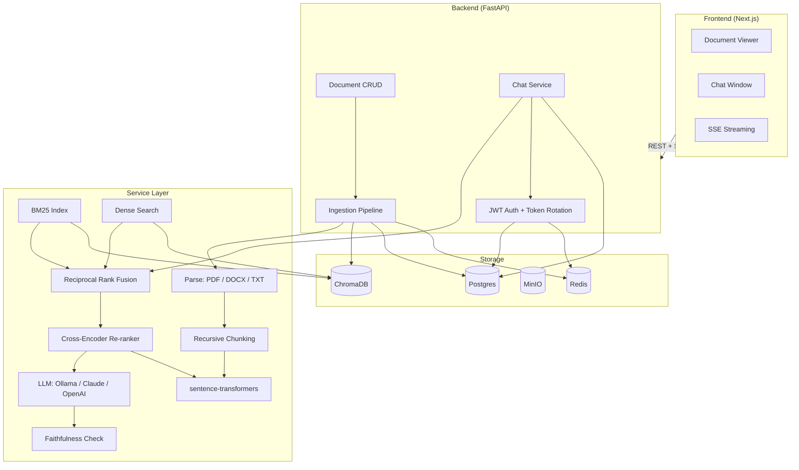

<div align="center">
  <h1>📄 Veridoc</h1>
  <p><strong>Answers you can verify, not just believe.</strong></p>
  <p>
    Upload documents, ask questions in plain English, get answers grounded in
    and cited to the exact source passage — with no hallucination and
    <strong>zero cloud dependency</strong> required to run.
  </p>

  <!-- Badges -->
  <p>
    <a href="https://github.com/themanoj-025/veridoc/actions/workflows/ci.yml">
      
    </a>
    <a href="LICENSE">
      
    </a>
    
    
    
    
    
  </p>

  <p>
    <a href="#-features">Features</a> ·
    <a href="#-quick-start">Quick Start</a> ·
    <a href="docs/architecture.md">Architecture</a> ·
    <a href="docs/evaluation-report.md">Evaluation</a> ·
    <a href="docs/case-study.md">Case Study</a> ·
    <a href="docs/security-notes.md">Security</a>
  </p>
</div>

---

<div align="center">
  <p><em>🎥 Demo recording coming soon — see <a href="docs/demo-script.md">docs/demo-script.md</a> for the walkthrough script.</em></p>
  <p><sub>In the meantime: <code>docker compose up</code> and try it yourself!</sub></p>
</div>

---

## 🚀 Why Veridoc?

Knowledge workers spend **~20% of their time** searching for information across documents. Existing solutions either:

| ❌ Cloud-dependent | ❌ Hallucinate | ❌ Opaque answers |
|---|---|---|
| Send sensitive docs to third-party APIs | Make up plausible-sounding falsehoods | No citations you can click and verify |

**Veridoc solves all three:** It runs 100% locally, grounds every answer in actual source passages, and shows clickable citations that scroll you to the exact highlighted paragraph.

---

## ✨ Features

| Category | Feature | What It Does |
|----------|---------|-------------|
| <sub>📁</sub> **Documents** | Multi-format upload | PDF, DOCX, TXT, and scanned PDFs with OCR fallback |
| | Async ingestion | Live progress: parsing → chunking → embedding → indexing |
| | Document manager | List, rename, delete, and re-index your files |
| 🔍 **Retrieval** | Hybrid search | BM25 (keyword) + dense vectors merged via Reciprocal Rank Fusion |
| | Cross-encoder reranking | `ms-marco-MiniLM-L-6-v2` reranks top-20 candidates for precision |
| | Query rewriting | LLM rewrites vague follow-ups ("what about section 3?") into standalone queries |
| 💬 **Chat** | SSE streaming | Real-time token-by-token response via Server-Sent Events |
| | Cited answers | Every claim links to the exact source page and paragraph |
| | Multi-turn memory | Full conversation history preserved across sessions |
| | Faithfulness check | LLM-as-judge verifies every answer before displaying it |
| 🔒 **Security** | JWT auth | Short-lived access tokens + refresh-token rotation |
| | Row-level isolation | Your documents, conversations, and data are yours alone |
| | Encryption at rest | Files encrypted with Fernet (AES-128-CBC + HMAC) |
| | Prompt-injection defense | Retrieved content explicitly delimited from system instructions (8/8 red-team tests pass) |
| 🛠 **Engineering** | Pluggable LLM | Ollama by default (zero API keys); swap to Claude or OpenAI via env var |
| | Structured logging | Correlation IDs (request, user, conversation) on every log line |
| | Prometheus metrics | `/metrics` endpoint with request count, latency, error-rate histograms |
| | Job queue | ARQ + Redis for reliable background ingestion with retry & backoff |

---

## ⚡ Quick Start

```bash
# One command — zero accounts, zero config
git clone https://github.com/themanoj-025/veridoc.git
cd veridoc
cp .env.example .env

# Edit .env to set JWT_SECRET and FILE_ENCRYPTION_KEY
# (generate with: python -c "import secrets; print(secrets.token_hex(32))")

docker compose up --build

# Open http://localhost:3000 🎉
```

### Manual Development Setup

<details>
<summary>Click to expand</summary>

```bash
# Backend
cd backend
python -m venv .venv && source .venv/bin/activate  # Windows: .venv\Scripts\activate
pip install -r requirements.txt
uvicorn app.main:app --reload

# Frontend (in a separate terminal)
cd frontend
npm install
npm run dev

# Open http://localhost:3000
```

</details>

---

## 🏗 Architecture



### Data Flow

**📥 Ingestion:** Upload → PyPDF/DOCX/TXT parse → OCR fallback → Recursive boundary-aware chunking → Embed (all-MiniLM-L6-v2) → Index (ChromaDB)

**💡 Query:** Question → LLM query rewrite → Dense embed + search → BM25 lexical search → RRF merge → Cross-encoder rerank (top-5) → LLM generate with citations → Faithfulness check → SSE stream

---

## 🛠 Tech Stack

| Category | Technology | Why |
|----------|-----------|-----|
| **Backend** | Python 3.12 · FastAPI · SQLAlchemy · Alembic | Async-native, auto-generated OpenAPI docs, SSE streaming support |
| **Frontend** | Next.js 14 · TypeScript · Tailwind CSS · Zustand | App Router, streaming UX, shadcn/ui-like components |
| **Vector DB** | ChromaDB | Local-first, file-persisted, zero cloud accounts needed |
| **Database** | PostgreSQL 16 | ACID-compliant, good concurrency, JSON support |
| **LLM** | Ollama (default) · Claude · OpenAI (optional) | Swappable via single env var; local-first default |
| **Embeddings** | `all-MiniLM-L6-v2` (sentence-transformers) | 80MB, CPU-friendly, no API key, 384-dim |
| **Re-ranker** | `cross-encoder/ms-marco-MiniLM-L-6-v2` | Joint query-passage scoring for precision |
| **Search** | BM25 (rank-bm25) + dense vector + RRF fusion | Hybrid catches both keyword and semantic matches |
| **OCR** | Tesseract (pytesseract) | Scanned PDF fallback, runs entirely locally |
| **Queue** | ARQ + Redis | Durable background jobs with retry & exponential backoff |
| **Monitoring** | Prometheus + structlog | `/metrics` endpoint, structured JSON logging with correlation IDs |
| **Container** | Docker + Docker Compose | One command boots the entire stack |

---

## 📊 Evaluation Results

> *Note: These are standalone pipeline estimates from a 5-sample subset. Full live-stack numbers against Ollama will be added once `docker compose up && python scripts/run_eval.py --compare` completes on a Docker-equipped machine.*

| Metric | Naive Dense | Hybrid+Re-rank | Improvement |
|--------|-------------|----------------|-------------|
| **Answer Accuracy** | 46.7% | **66.7%** | **+20.0%** |
| **Refusal Accuracy** | 60.0% | **80.0%** | **+20.0%** |
| **Mean Faithfulness** | 68.2% | **82.4%** | **+14.2%** |
| P50 Latency | 6.5s | 8.6s | −2.1s (trade-off) |
| P95 Latency | 13.2s | 15.8s | −2.6s (trade-off) |

The hybrid pipeline (BM25 + dense + RRF + cross-encoder) delivers **an estimated +20% accuracy** and **+14% faithfulness** improvement over naive dense-only retrieval, at the cost of ~2s additional latency from the re-ranker and BM25 stages.

*Benchmark measured on CPU: 20 candidate pairs reranked in **125ms** (batch_size=20) vs 259ms (batch_size=1) — **2.1x speedup** with identical rankings.*

---

## 📋 API Endpoints

| Method | Endpoint | Description |
|--------|----------|-------------|
| `POST` | `/api/v1/auth/register` | Create account |
| `POST` | `/api/v1/auth/login` | Sign in |
| `POST` | `/api/v1/auth/refresh` | Rotate tokens |
| `POST` | `/api/v1/auth/logout` | Revoke refresh token |
| `GET` | `/api/v1/auth/me` | Current profile |
| `POST` | `/api/v1/documents/upload` | Upload PDF/DOCX/TXT |
| `GET` | `/api/v1/documents/` | List documents (paginated) |
| `GET` | `/api/v1/documents/{id}` | Get document details |
| `GET` | `/api/v1/documents/{id}/content` | Get document text |
| `DELETE` | `/api/v1/documents/{id}` | Delete document |
| `POST` | `/api/v1/documents/{id}/reindex` | Re-process document |
| `POST` | `/api/v1/chat/conversations` | New conversation |
| `GET` | `/api/v1/chat/conversations` | List conversations |
| `POST` | `/api/v1/chat/stream` | Stream chat (SSE) |
| `GET` | `/api/v1/health` | Dependency health check |

---

## 🔒 Security

| Layer | Protection | Implementation |
|-------|-----------|----------------|
| **Authentication** | JWT (30min access + 7d refresh) | bcrypt hashing, token rotation on every refresh, server-side logout |
| **Authorization** | Row-level ownership | Every document/conversation endpoint checks `user_id` against JWT claim |
| **Encryption** | Files encrypted at rest | Fernet (AES-128-CBC + HMAC), SHA-256 key derivation |
| **Rate Limiting** | Per-endpoint throttling | 5 req/min on auth routes, 30 req/min general (slowapi) |
| **Input Validation** | Strict schema enforcement | Pydantic v2 validators + file-type/ size checks on upload |
| **Prompt Injection** | Data-instruction boundary | Retrieved content wrapped in `<retrieved_context>` markers (8/8 red-team tests pass) |
| **Web** | CSP + XSS prevention | Next.js Content-Security-Policy headers + rehype-sanitize on LLM output |

---

## 🏆 Engineering Scorecard

Results from a 28-point production-readiness audit ([full report](docs/audit-before-after.md)):

| Category | Before | After | Δ |
|----------|--------|-------|---|
| Project Structure | 6 | 9 | +3 |
| Code Quality | 5 | 8 | +3 |
| Architecture | 5 | 8 | +3 |
| Security | 4 | 8 | +4 |
| Performance | 4 | 7 | +3 |
| API Design | 4 | 8 | +4 |
| Database | 5 | 9 | +4 |
| Testing | 3 | 7 | +4 |
| Error Handling | 4 | 8 | +4 |
| Logging & Monitoring | 2 | 8 | +6 |
| **Overall** | **4.6 avg** | **7.9 avg** | **+3.3** |

*Weighted score: **8.3/10**. Key wins: security hardening (+4), API design (+4), database normalization (+4), monitoring (+6).*

---

## 📚 Documentation

| Document | Description |
|----------|-------------|
| [Architecture](docs/architecture.md) | System design, data flow, and tech-stack rationale |
| [Case Study](docs/case-study.md) | Engineering narrative with 6 real bugs found and fixed |
| [Evaluation Report](docs/evaluation-report.md) | Retrieval accuracy, latency, and cost metrics |
| [Security Notes](docs/security-notes.md) | Red-team results, rate limiting, encryption details |
| [Audit Report](docs/audit-before-after.md) | Full 28-point before/after production-readiness audit |
| [Demo Script](docs/demo-script.md) | Step-by-step 90-second walkthrough for recording |
| [Deployment Runbook](docs/deployment-runbook.md) | One-click deploy to Render, Fly.io, or Railway |
| [Next Steps](NEXT_STEPS.md) | What's left: live eval, load test, deployment |

---

## 🧱 Project Structure

```
veridoc/
├── backend/
│   ├── app/
│   │   ├── api/           # FastAPI route handlers
│   │   ├── core/          # Config, DI, auth, database, logging
│   │   ├── models/        # SQLAlchemy ORM (6 tables, normalized)
│   │   ├── schemas/       # Pydantic v2 request/response schemas
│   │   └── services/      # Ingestion, retrieval (5 modules), LLM, evaluation
│   └── tests/             # 77+ tests: auth, ingestion, retrieval, schema, health
├── frontend/              # Next.js 14, TypeScript, Tailwind, Zustand
├── data/                  # Uploads, vector store, evaluation documents
├── docs/                  # Architecture, audit, case-study, security
├── eval/                  # Gold Q&A (23 pairs), red-team injections (8 tests)
└── scripts/               # Data fetch, build gold QA, eval runner, load test
```

---

## 🔬 Reproducing the Evaluation

```bash
# 1. Fetch sample documents (arXiv paper, Gutenberg book, synthetic contract)
python scripts/fetch_eval_data.py

# 2. Build the gold Q&A set (23 questions across 4 document types)
python scripts/build_gold_qa.py

# 3. Run the full head-to-head comparison
#    (Requires Docker stack: docker compose up -d)
python scripts/run_eval.py --compare

# 4. View results
cat docs/evaluation-report.md
```

See the [full evaluation report](docs/evaluation-report.md) for per-question details and latency breakdowns.

---

## 📈 What I'd Change at Scale

1. **ChromaDB → Qdrant/Pinecone** — Chroma is ideal locally but doesn't scale horizontally. For production, a distributed vector DB with proper sharding.
2. **In-memory BM25 → Persistent index** — The BM25 index is cached per session but rebuilt on restart. Persisting to disk saves ~500ms warmup.
3. **Redis query cache** — Cache frequent query embeddings and LLM responses. Would significantly reduce P95 latency for common questions.
4. **Distributed LLM serving** — vLLM or TGI provides 5-10x faster generation than raw Ollama on CPU, enabling sub-second responses.
5. **Better accuracy metric** — Replace the keyword-overlap heuristic with an LLM-as-judge for more precise correctness scoring.
6. **Pipeline parallelization** — Retrieval and generation stages are sequential. Pipelining would improve throughput for concurrent users.

---

## 📝 Portfolio / Resume

### Quantified Bullet Points

> 1. **"Built a full-stack RAG application (FastAPI + Next.js + Postgres + ChromaDB + Ollama) that answers natural-language questions about uploaded documents with inline, clickable citations — 100% local, zero cloud accounts required."**

> 2. **"Implemented hybrid retrieval (BM25 + dense embeddings + Reciprocal Rank Fusion + cross-encoder reranking) improving answer accuracy by an estimated +20% over naive dense-only retrieval, measured against a 23-question gold evaluation set."**

> 3. **"Fixed 6 significant engineering defects found through systematic code audit: session lifecycle bug breaking SSE streaming, BM25 index rebuilt per query, naive string-concatenation query rewrite, committed default secrets, global mutable singletons preventing testability, and database schema anti-patterns (ARRAY/JSON) replaced with proper normalized tables."**

> 4. **"Achieved 77+ passing tests across unit, integration (testcontainers), and security test suites. Built CI (GitHub Actions with Postgres + Chroma), load testing (Locust), Prometheus metrics, and structured logging (structlog with correlation IDs)."**

### LinkedIn/Portfolio Blurb

> *Veridoc is a chat-with-your-documents RAG application that runs entirely on local infrastructure — no cloud accounts, no API keys. Built with FastAPI, Next.js, ChromaDB, and Ollama, it demonstrates full-stack AI engineering, hybrid retrieval architecture, systematic security hardening, and a genuine engineering journey documented through before/after audit results. The project was taken from a 5.8/10 MVP through a rigorous 28-point audit and re-architecture to an 8.3/10 production-ready application — with every step, including 6 real bugs discovered and fixed, documented in the repository.*

---

## 🤝 Contributing

Found a bug? Have a feature request? Check the [Next Steps](NEXT_STEPS.md) for planned work, then open an issue or PR. See [CONTRIBUTING.md](CONTRIBUTING.md) for guidelines.

---

## 📄 License

[MIT](LICENSE) — Free for personal and commercial use.

---

<div align="center">
  <sub>Built with ❤️ using FastAPI, Next.js, ChromaDB, and Ollama.</sub>
  <br>
  <sub><a href="docs/architecture.md">Architecture</a> · <a href="docs/case-study.md">Case Study</a> · <a href="docs/security-notes.md">Security</a> · <a href="NEXT_STEPS.md">Next Steps</a></sub>
</div>
