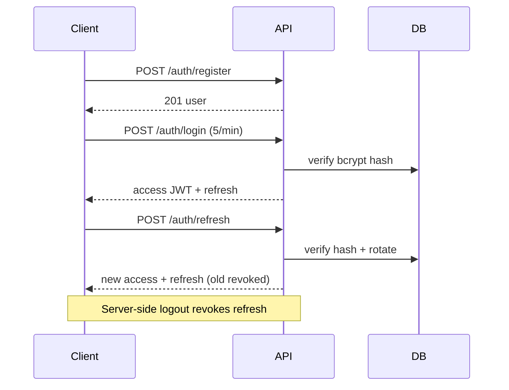

# API — Veridoc: API Reference

| Field | Value |
|---|---|
| Version | v0.1 |
| Last Updated | 2026-08-06 |
| Owner | Backend Engineer |
| Status | Approved |

Base URL (dev): `http://localhost:8000`. All routes prefixed `/api/v1/`. List endpoints use `limit`/`offset` and return `{items, total, limit, offset}`.

## 1. Endpoint Summary

| Method | Path | Auth | Purpose |
|---|---|---|---|
| POST | /api/v1/auth/register | N | Create account |
| POST | /api/v1/auth/login | N | Sign in (5/min) |
| POST | /api/v1/auth/refresh | N | Rotate refresh token |
| POST | /api/v1/auth/logout | JWT | Revoke refresh token |
| GET | /api/v1/auth/me | JWT | Current user |
| POST | /api/v1/documents/upload | JWT | Upload PDF/DOCX/TXT |
| GET | /api/v1/documents/ | JWT | List (paginated) |
| GET | /api/v1/documents/{id} | JWT | Metadata |
| GET | /api/v1/documents/{id}/content | JWT | Full text |
| DELETE | /api/v1/documents/{id} | JWT | Delete + chunks |
| POST | /api/v1/documents/{id}/reindex | JWT | Reprocess |
| POST | /api/v1/chat/conversations | JWT | Create conversation |
| GET | /api/v1/chat/conversations | JWT | List conversations |
| POST | /api/v1/chat/stream | JWT | SSE chat stream |
| GET | /api/v1/health | N | Dependency health |

## 2. Auth

- Access JWT: 30 min. Refresh: 7 days, rotation on every use, server-side logout.
- Tokens delivered per client contract (frontend stores refresh per security notes; access in memory).
- Row-level isolation: every document/conversation endpoint validates `user_id` from JWT — cross-user ids → 403.

## 3. Endpoint Details

### POST /api/v1/documents/upload

**Request:** multipart/form-data `file` (pdf/docx/txt).

**Response 202**

```json
{ "id": "d1", "name": "contract-2026.pdf", "status": "uploaded", "job_id": "j1" }
```

| Code | Meaning |
|---|---|
| 202 | Accepted for ingestion |
| 400 | E400_UNSUPPORTED_TYPE |
| 401 | E401_UNAUTHORIZED |
| 429 | E429_RATE_LIMIT |

### POST /api/v1/chat/stream

**Request**

```json
{ "conversation_id": "cv1", "message": "What is the termination clause?", "document_ids": ["d1"] }
```

**Response 200 — SSE stream**

```
event: token
data: {"delta": "The "}

event: token
data: {"delta": "termination clause"}

event: citation
data: {"citations": [{"document_id": "d1", "page": 3, "paragraph": 2}]}

event: done
data: {"message_id": "m1", "faithfulness": 0.94}
```

| Code | Meaning |
|---|---|
| 200 | SSE stream |
| 400 | E400_VALIDATION |
| 403 | E403_FORBIDDEN — cross-user doc |
| 429 | E429_RATE_LIMIT |
| 503 | E503_PROVIDER_DOWN — LLM unavailable |

### GET /api/v1/health

```json
{ "status": "ok", "dependencies": { "postgres": "ok", "chromadb": "ok", "minio": "ok", "llm": "ok" } }
```

## 4. Auth Flow (sequence)



## 5. Rate Limits & Versioning

- Auth routes: 5 req/min. General: 30 req/min (slowapi).
- Versioning: `/api/v1/` current; breaking changes → `/api/v2/`.
- Full OpenAPI at `/docs`; schemathesis used for fuzzing.

## 6. Related Documents

| Document | Relationship |
|---|---|
| TechSpec.md | Implementation |
| Schema.md | Table mapping |
| SecurityAndCompliance.md | Auth/isolation policy |
| Testing.md | Contract + fuzz tests |
