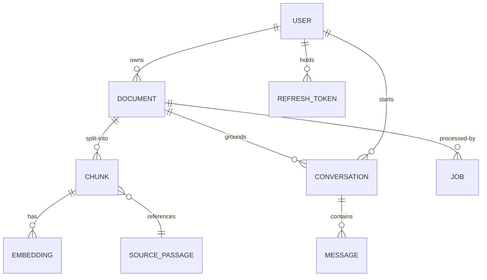

# Schema — Veridoc: Data Model & Database Design

| Field | Value |
|---|---|
| Version | v0.1 |
| Last Updated | 2026-08-06 |
| Owner | Data Engineer |
| Status | Approved |

---

## 1. ER Diagram



## 2. Table/Collection Definitions

### TBL-user

| Field | Type | Nullable | Default | Constraints | Description |
|---|---|---|---|---|---|
| id | UUID | N | — | PK | User identifier |
| email | string | N | — | unique | Login email |
| password_hash | string | N | — | bcrypt | Credential hash |
| created_at | datetime | N | now() | — | Signup time |

### TBL-document

| Field | Type | Nullable | Default | Constraints | Description |
|---|---|---|---|---|---|
| id | UUID | N | — | PK | Document id |
| user_id | UUID | N | — | FK → TBL-user | Owner (row-level isolation) |
| name | string | N | — | len ≤ 255 | Display name |
| file_key | string | N | — | unique | MinIO object key |
| file_type | enum | N | — | pdf/docx/txt | Format |
| file_size | bigint | N | 0 | ≥ 0 | Bytes |
| status | enum | N | "uploaded" | uploaded/parsing/chunking/embedding/indexed/failed | Lifecycle |
| ocr_used | boolean | N | false | — | Scanned fallback |
| created_at | datetime | N | now() | — | Upload time |

### TBL-chunk

| Field | Type | Nullable | Default | Constraints | Description |
|---|---|---|---|---|---|
| id | UUID | N | — | PK | Chunk id |
| document_id | UUID | N | — | FK → TBL-document (cascade) | Parent doc |
| content | text | N | — | — | Passage text |
| page_number | int | Y | null | ≥ 1 | Source page |
| paragraph_index | int | Y | null | ≥ 0 | Source paragraph |
| chunk_index | int | N | 0 | ≥ 0 | Order in doc |
| created_at | datetime | N | now() | — | Time |

### TBL-embedding (vector metadata — ChromaDB)

| Field | Type | Nullable | Default | Constraints | Description |
|---|---|---|---|---|---|
| id | UUID | N | — | PK | Embedding id |
| chunk_id | UUID | N | — | FK → TBL-chunk (cascade) | Source chunk |
| model | string | N | "all-MiniLM-L6-v2" | — | Embedding model |
| vector (in Chroma) | float[384] | N | — | — | Dense vector |
| created_at | datetime | N | now() | — | Time |

### TBL-conversation

| Field | Type | Nullable | Default | Constraints | Description |
|---|---|---|---|---|---|
| id | UUID | N | — | PK | Conversation id |
| user_id | UUID | N | — | FK → TBL-user | Owner |
| title | string | Y | null | — | Auto/set title |
| created_at | datetime | N | now() | — | Start |
| updated_at | datetime | N | now() | — | Last message |

### TBL-message

| Field | Type | Nullable | Default | Constraints | Description |
|---|---|---|---|---|---|
| id | UUID | N | — | PK | Message id |
| conversation_id | UUID | N | — | FK → TBL-conversation (cascade) | Parent |
| role | enum | N | "user" | user/assistant | Speaker |
| content | text | N | — | — | Body |
| faithfulness | float | Y | null | 0..1 | Judge score |
| citations | jsonb | Y | null | — | [{document_id, page, paragraph}] |
| created_at | datetime | N | now() | — | Time |

### TBL-refresh_token

| Field | Type | Nullable | Default | Constraints | Description |
|---|---|---|---|---|---|
| id | UUID | N | — | PK | Token id |
| user_id | UUID | N | — | FK → TBL-user | Owner |
| token_hash | string | N | — | bcrypt | Stored hash |
| expires_at | datetime | N | — | 7 days | Expiry |
| revoked_at | datetime | Y | null | — | Rotation |

### TBL-job

| Field | Type | Nullable | Default | Constraints | Description |
|---|---|---|---|---|---|
| id | UUID | N | — | PK | Job id |
| document_id | UUID | N | — | FK → TBL-document | Target |
| kind | enum | N | "ingest" | ingest/reindex | Type |
| status | enum | N | "queued" | queued/running/succeeded/failed | ARQ state |
| attempts | int | N | 0 | ≥ 0 | Retry count |
| error | text | Y | null | — | Failure detail |
| created_at | datetime | N | now() | — | Queued time |

## 3. Relationships & Foreign Keys

| From | To | Type | On Delete | Justification |
|---|---|---|---|---|
| TBL-document.user_id | TBL-user | N:1 | Cascade | Docs die with user (GDPR) |
| TBL-chunk.document_id | TBL-document | N:1 | Cascade | Chunks die with doc |
| TBL-embedding.chunk_id | TBL-chunk | 1:1 | Cascade | Vectors die with chunk |
| TBL-conversation.user_id | TBL-user | N:1 | Cascade | Privacy |
| TBL-message.conversation_id | TBL-conversation | N:1 | Cascade | History dies with convo |
| TBL-refresh_token.user_id | TBL-user | N:1 | Cascade | Tokens die with user |
| TBL-job.document_id | TBL-document | N:1 | Cascade | Jobs die with doc |

## 4. Indexes

| Table | Index | Columns | Type | Reason |
|---|---|---|---|---|
| TBL-document | ix_doc_user | user_id, created_at | composite | Library listing |
| TBL-chunk | ix_chunk_doc | document_id | btree | Doc retrieval |
| TBL-message | ix_msg_convo | conversation_id, created_at | composite | Chat history |
| TBL-document | ix_doc_search | name (tsvector) | GIN | Full-text search |
| TBL-refresh_token | ix_rt_user | user_id | btree | Rotation |
| TBL-job | ix_job_status | status | btree | Queue polling |

## 5. Enums / Constants

| Field | Allowed Values |
|---|---|
| document.file_type | pdf, docx, txt |
| document.status | uploaded, parsing, chunking, embedding, indexed, failed |
| message.role | user, assistant |
| job.kind | ingest, reindex |
| job.status | queued, running, succeeded, failed |
| EMBED_DIM | 384 |
| RERANK_TOP_K | 5 (from 20) |
| ACCESS_TTL_MIN | 30 |
| REFRESH_TTL_DAYS | 7 |
| AUTH_RATE_LIMIT | 5/min |
| GENERAL_RATE_LIMIT | 30/min |

## 6. Data Lifecycle

- Retention: docs/chunks/conversations retained until user deletes; deletion cascades fully.
- Encryption: file bytes encrypted at rest (Fernet) in MinIO; keys in env (fail-fast if missing).
- Soft-delete: none in v1 — hard delete with cascade (documented ADR/decision in docs/DECISIONS.md).

## 7. Migrations Strategy

- Alembic; naming `NNNN_short_desc`; upgrade + downgrade tested in CI.
- Every migration ships with its PR + Schema.md update.

## 8. Sample Records

```json
{
  "user": { "id": "u1", "email": "priya@example.com" },
  "document": { "id": "d1", "user_id": "u1", "name": "contract-2026.pdf", "status": "indexed", "ocr_used": false },
  "chunk": { "id": "c1", "document_id": "d1", "page_number": 3, "paragraph_index": 2, "content": "The parties agree to..." },
  "message": { "id": "m1", "conversation_id": "cv1", "role": "assistant", "content": "Under clause 4.2...", "faithfulness": 0.94, "citations": [{"document_id": "d1", "page": 3, "paragraph": 2}] }
}
```

## 9. Data Validation Rules

| Field | Enforced In | Rule |
|---|---|---|
| user.email | App + DB | unique, valid format |
| document.file_type | App | pdf/docx/txt only |
| document.file_size | App | ≥ 0 |
| message.faithfulness | App | 0..1 |
| citations shape | App (Pydantic) | document_id + page + paragraph |
| password | App | ≥ 8 chars, 2 of upper/digit/symbol |

## 10. Sensitive Data Map

| Field | Sensitivity | Encrypt at Rest | Mask Logs |
|---|---|---|---|
| user.email | PII | Yes | Yes |
| password_hash | Credential | Hashed | N/A |
| document bytes | PII (possible) | Fernet AES-128-CBC + HMAC | Never logged |
| chunk/message content | PII (possible) | Volume encryption | Truncated in logs |
| refresh token hash | Credential | Hashed | Never logged |

## 11. Related Documents

| Document | Relationship |
|---|---|
| API.md | Endpoints per table |
| TechSpec.md | Chroma/Postgres split |
| SecurityAndCompliance.md | Encryption + isolation |
| Testing.md | Migration + integration tests |
