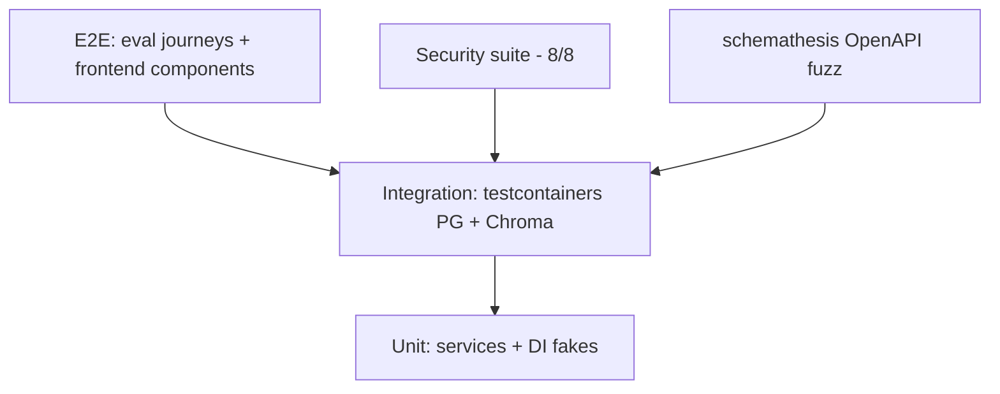

# Testing — Veridoc: Test Strategy

| Field | Value |
|---|---|
| Version | v0.1 |
| Last Updated | 2026-08-06 |
| Owner | QA Engineer |
| Status | Approved |

---

## 1. Test Pyramid

- Backend: 77 collected tests across 8 files (6 modules), 3,007 test lines.
- Frontend: 5 components tested (AuthProvider, ChatPanel, DocumentList, DocumentViewer, ErrorBoundary).

## 2. Unit Strategy

| Area | Cases |
|---|---|
| Auth service | Register/login/refresh rotation, password policy |
| Ingestion services | Parsing branches, chunk boundaries |
| Retrieval | BM25/dense fusion, rerank ordering |
| Faithfulness | Gate accept/reject logic |

## 3. Integration Strategy

| Area | Cases |
|---|---|
| Ingestion lifecycle | upload → parse → chunk → embed → indexed (real PG + Chroma) |
| Chat | Conversation CRUD, message persistence, citations |
| Health | All 4 dependencies reported |
| Migrations | Alembic upgrade/downgrade round-trips |

## 4. Security Test Cases (8/8)

| # | Case | Expectation |
|---|---|---|
| 1 | Tampered JWT | 401 |
| 2 | Expired JWT | 401 |
| 3 | Cross-user document access | 403 |
| 4 | SQL injection payload | No data leak |
| 5-8 | Prompt injections (4 variants) | Context boundary holds |

## 5. Test Data Strategy

- `eval/`: gold Q&A (23 pairs across 4 document types), red-team injections (8).
- Testcontainers: real Postgres + ChromaDB in CI (not mocks).
- No real user PII in tests.

## 6. CI Gates (GitHub Actions)

| Gate | Command/Job | Blocking |
|---|---|---|
| Backend tests | pytest (77) | Yes |
| Security | 8/8 red-team | Yes |
| Frontend | Vitest components | Yes |
| Fuzz | schemathesis | Yes |
| Lint | ruff/ESLint | Yes |
| Docker | compose build | Yes |
| Dependabot | vulnerability scan | Yes |

## 7. Known Local Gap

- `asyncpg` missing locally blocks `conftest.py` import → run tests via CI or install dep (Tracker R-01).

## 8. Related Documents

| Document | Relationship |
|---|---|
| Rules.md | Requirements (Section 4) |
| API.md | Contracts under test |
| PRD.md | Eval metrics |
| Tracker.md | Test status |
