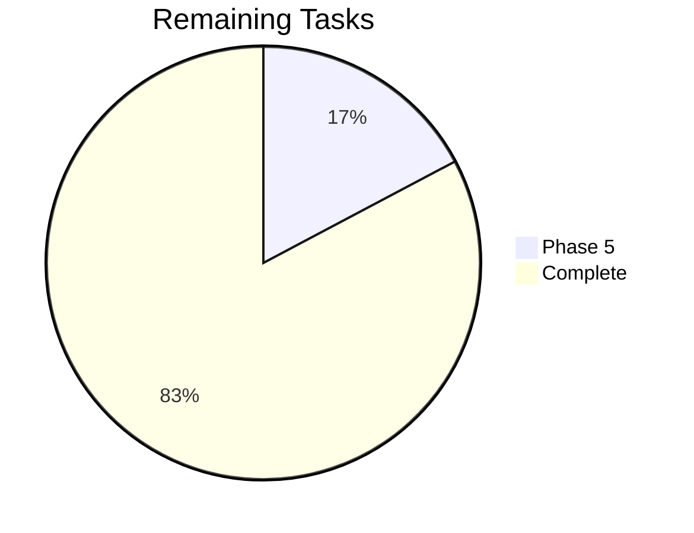

# Tracker — Veridoc: Living Status Tracker

| Field | Value |
|---|---|
| Version | v0.1 |
| Last Updated | 2026-08-06 |
| Owner | Tech Lead |
| Status | Active |

---

## 1. Snapshot Dashboard

| Metric | Value |
|---|---|
| Overall % Complete | 90% |
| Current Phase | Phase 5 — Completion |
| Tasks Done / Total | 24 / 29 |
| Blockers (open) | 1 (R-01 asyncpg local env) |
| Days to Target (live eval) | 40 |

## 2. Status Legend

🟢 Done | 🟡 In Progress | 🔴 Blocked | ⚪ Not Started | 🔵 In Review

## 3. Phase Progress Bars

| Phase | Progress |
|---|---|
| Phase 0 — MVP Skeleton | [██████████] 100% |
| Phase 1 — Ingestion | [██████████] 100% |
| Phase 2 — Retrieval | [██████████] 100% |
| Phase 3 — Chat | [██████████] 100% |
| Phase 4 — Hardening | [██████████] 100% |
| Phase 5 — Completion | [██░░░░░░░░] 20% |

## 4. Full Task Table

| TASK | Description | Status | Assignee | Start | Target | Actual | Notes |
|---|---|---|---|---|---|---|---|
| TASK-0.1 | Docker compose stack | 🟢 | Owner | 03-01 | 03-03 | 03-02 | HEALTHCHECKs |
| TASK-0.2 | JWT auth + rotation | 🟢 | Owner | 03-03 | 03-06 | 03-05 | — |
| TASK-0.3 | Upload + MinIO | 🟢 | Owner | 03-06 | 03-08 | 03-07 | — |
| TASK-1.1 | Parser + OCR | 🟢 | Owner | 03-12 | 03-15 | 03-14 | — |
| TASK-1.2 | Chunker | 🟢 | Owner | 03-15 | 03-17 | 03-16 | — |
| TASK-1.3 | Embedder | 🟢 | Owner | 03-17 | 03-19 | 03-18 | MiniLM |
| TASK-1.4 | ARQ queue | 🟢 | Owner | 03-19 | 03-21 | 03-20 | retry/backoff |
| TASK-2.1 | BM25+dense+RRF | 🟢 | Owner | 03-22 | 03-25 | 03-24 | — |
| TASK-2.2 | Rerank batched | 🟢 | Owner | 03-25 | 03-27 | 03-26 | 2.1x |
| TASK-2.3 | Query rewrite | 🟢 | Owner | 03-27 | 03-29 | 03-28 | — |
| TASK-2.4 | Eval pipeline | 🟢 | Owner | 03-29 | 04-01 | 03-31 | gold 23 |
| TASK-3.1 | SSE streaming | 🟢 | Owner | 04-03 | 04-05 | 04-04 | — |
| TASK-3.2 | Citations + jump | 🟢 | Owner | 04-05 | 04-08 | 04-07 | — |
| TASK-3.3 | Multi-turn memory | 🟢 | Owner | 04-08 | 04-10 | 04-09 | — |
| TASK-3.4 | Faithfulness check | 🟢 | Owner | 04-10 | 04-12 | 04-11 | — |
| TASK-4.1 | Row-level isolation | 🟢 | Owner | 04-15 | 04-17 | 04-16 | — |
| TASK-4.2 | Fernet encryption | 🟢 | Owner | 04-17 | 04-19 | 04-18 | — |
| TASK-4.3 | Rate limiting | 🟢 | Owner | 04-19 | 04-20 | 04-19 | — |
| TASK-4.4 | Prompt-injection defense | 🟢 | Owner | 04-20 | 04-23 | 04-22 | 8/8 tests |
| TASK-4.5 | Logging + metrics + health | 🟢 | Owner | 04-23 | 04-26 | 04-25 | — |
| TASK-5.1 | Live 23-question eval | 🟡 | Owner | 08-10 | 09-15 | — | Needs Docker stack |
| TASK-5.2 | Demo URL/video | ⚪ | Owner | — | 09-30 | — | — |
| TASK-5.3 | Persistent BM25 index | ⚪ | Owner | — | 10-15 | — | — |
| TASK-5.4 | Fix asyncpg local gap | 🔴 | Owner | 08-10 | 08-11 | — | Missing dep (R-01) |
| TASK-5.5 | Redis query cache | ⚪ | Owner | — | 10-20 | — | — |

## 5. Blockers Log

| ID | Description | Raised | Owner | Impact | Status |
|---|---|---|---|---|---|
| R-01 | `asyncpg` missing locally → `backend/tests/conftest.py` fails import (create_async_engine) | 2026-08-06 | Owner | Local test runs blocked; CI unaffected | Open — add to requirements |

## 6. Changelog

- 2026-08-06: Documentation suite generated (14 files); R-01 blocker logged.
- 2026-04-25: Observability + health checks shipped.
- 2026-04-22: Prompt-injection defense 8/8 tests passing.
- 2026-03-31: Eval pipeline with 23-question gold set.
- Audit journey: 5.8/10 MVP → 8.3/10 production-ready (docs/audit-before-after.md).
- 6 defects found via 28-point audit, all fixed with tests.

## 7. Burndown Summary

## 8. Next 3 Priorities

1. TASK-5.4 — add `asyncpg` to requirements + reinstall (clear R-01).
2. TASK-5.1 — run live 23-question eval on Docker stack.
3. TASK-5.2 — publish demo URL or video.

## 9. Related Documents

| Document | Relationship |
|---|---|
| ImplementationPlan.md | Task source |
| PRD.md | Feature status |
| RiskRegister.md | R-01 detail |
