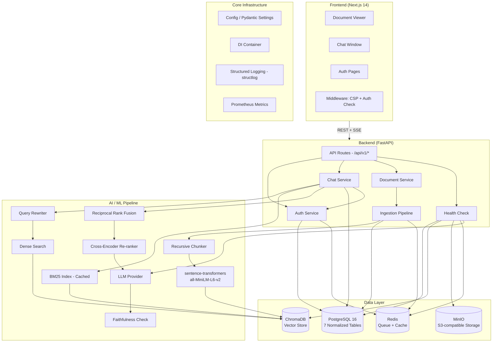

# Veridoc — Architecture

## System Overview

Veridoc is a **Retrieval-Augmented Generation (RAG)** application that answers natural-language questions about uploaded documents. It runs entirely locally with zero external accounts — all services are containerized via Docker Compose.

## High-Level Architecture



## Component Details

### 1. Frontend (Next.js 14)

| Component | Purpose | Key Features |
|-----------|---------|--------------|
| `AuthProvider` | Wraps app with authentication context | Token refresh, login state |
| `ChatPanel` | Chat interface with SSE streaming | Streaming cursor, citation chips, error boundary |
| `DocumentList` | Document management panel | Upload progress, status indicators, CRUD |
| `DocumentViewer` | Reading pane with citation highlighting | Scroll-to-highlight, split-pane layout |
| `ErrorBoundary` | Catches rendering errors | Prevents blank-page crashes |
| Middleware | CSP headers + auth redirect | Content-Security-Policy, route protection |

### 2. Backend (FastAPI)

| Module | Endpoints | Purpose |
|--------|-----------|---------|
| `api/auth.py` | Register, Login, Refresh, Logout, Me | JWT auth with token rotation |
| `api/documents.py` | Upload, List, Get, Update, Delete, Reindex | Document CRUD with pagination |
| `api/chat.py` | Conversations CRUD, SSE Stream | Multi-turn chat with streaming |
| `api/health.py` | Health check | Real dependency pings |

### 3. Service Layer

| Service | Responsibility | Dependencies |
|---------|---------------|-------------|
| `ChatService` | Orchestrate retrieve→rerank→generate→faithfulness | Retriever, LLM, DB Session |
| `AuthService` | User registration, login, token management | DB Session, Token Store |
| `IngestionService` | Parse→chunk→embed→index pipeline | Parser, Chunker, Embedder, VectorStore |
| `HybridRetriever` | BM25 + Dense + RRF + Rerank fusion | BM25, Dense, CrossEncoder |

### 4. AI/ML Pipeline

#### Ingestion Pipeline
```
Upload → File Type Detection → 
  ├── PDF → PyMuPDF (text) or Tesseract (OCR for scanned)
  ├── DOCX → python-docx
  └── TXT → plain text
→ Recursive Chunking (paragraph → sentence → word fallback)
→ Embedding (all-MiniLM-L6-v2, 384-dim)
→ Index in ChromaDB
→ Persist metadata in PostgreSQL
```

#### Query Pipeline
```
User Question 
  → LLM Query Rewrite (if follow-up with history)
  → Parallel Execution:
      ├── Dense Search (ChromaDB, cosine similarity, top-20)
      └── BM25 Search (cached index, top-20)
  → RRF Merge (k=60 for balanced fusion)
  → Cross-Encoder Rerank (top-5)
  → Build Context with <retrieved_context> markers
  → LLM Generate (Ollama / Claude / OpenAI)
  → Faithfulness Check (LLM-as-judge)
  → SSE Stream to Frontend
```

## Data Flow

### Authentication Flow
```
Register → POST /api/v1/auth/register
  → bcrypt hash password
  → INSERT into users table
  → Return JWT (access 30min + refresh 7d)

Login → POST /api/v1/auth/login
  → Verify password hash
  → Generate JWT pair
  → Store JTI in Redis (for rotation)
  → Return tokens

Refresh → POST /api/v1/auth/refresh
  → Verify refresh token signature
  → Check JTI against blacklist (reuse detection)
  → Blacklist old JTI
  → Issue new JWT pair

Logout → POST /api/v1/auth/logout
  → Blacklist refresh token JTI
  → Access token expires naturally (30min)
```

### Question-Answering Flow
```
1. User types question in ChatPanel
2. Frontend POSTs to /api/v1/chat/stream with conversation_id + message
3. Backend ChatService:
   a. Saves user message to DB
   b. LLM Query Rewrite (if multi-turn follow-up)
   c. Parallel BM25 + Dense retrieval (top-20 each)
   d. RRF merge (balanced ranks)
   e. Cross-encoder rerank (top-5 most relevant)
   f. Build context from top chunks
   g. LLM generate with citations
   h. Faithfulness check (score >= 0.5 threshold)
   i. Save assistant message + citations to DB
   j. Stream tokens + citations via SSE
4. Frontend renders streaming text + citation chips
5. User clicks citation → DocumentViewer scrolls + highlights
```

## Database Schema

### 7 Normalized Tables

```
users (id, email, hashed_password, full_name, is_active, created_at)
  │
  ├── documents (id, user_id FK, filename, file_type, file_size, status, created_at)
  │     └── chunks (id, document_id FK, content, chunk_index, embedding_id)
  │
  ├── conversations (id, user_id FK, title, created_at, updated_at)
  │     └── conversation_documents (conversation_id FK, document_id FK) [junction]
  │
  └── messages (id, conversation_id FK, role, content, created_at)
        └── citation_records (id, message_id FK, chunk_id FK, relevance_score)
```

### Key Indexes

| Table | Index | Purpose |
|-------|-------|---------|
| `documents` | `(user_id, created_at)` | List user documents sorted by date |
| `conversations` | `(user_id, created_at)` | List user conversations sorted by date |
| `chunks` | `content` (GIN tsvector) | Full-text search |
| `messages` | `conversation_id` | Load conversation messages |

## Deployment Architecture

### Development (Docker Compose)

```
┌──────────────────────────────────────┐
│  docker compose up                    │
│                                      │
│  postgres:16    redis:7    chroma     │
│    :5432         :6379      :8000     │
│                                      │
│  minio:latest   ollama:latest         │
│    :9000         :11434               │
│                                      │
│  backend:8000   worker:8000           │
│  frontend:3000  (ingestion worker)    │
└──────────────────────────────────────┘
```

### Production (Recommended)

```
                     ┌─────────────┐
                     │  CDN/Proxy   │
                     │  (Caddy/Nginx)│
                     └──────┬──────┘
                            │
              ┌─────────────┴─────────────┐
              │     Load Balancer          │
              └─────────────┬─────────────┘
                            │
              ┌─────────────┴─────────────┐
              │     FastAPI (uvicorn)      │
              │  Horizontal scaling (×N)   │
              └──────┬──────────┬─────────┘
                     │          │
        ┌────────────┴──┐  ┌───┴────────────┐
        │  PostgreSQL   │  │  ChromaDB       │
        │  (Read replica)│  │  (or Qdrant)   │
        └───────────────┘  └────────────────┘
```

## Key Design Decisions

| Decision | Choice | Rationale |
|----------|--------|-----------|
| **Framework** | FastAPI | Native async, Pydantic v2, SSE streaming, auto OpenAPI |
| **Vector DB** | ChromaDB | Local-first, disk-persisted, zero cloud accounts |
| **LLM Default** | Ollama | Open-weight models, no API keys, local inference |
| **LLM Optional** | Claude/OpenAI | Provider abstraction via single env var |
| **Embeddings** | `all-MiniLM-L6-v2` | 80MB, CPU-friendly, 384-dim, no API key |
| **Search** | BM25 + Dense + RRF + Rerank | Hybrid catches keyword + semantic + reranks for precision |
| **No LangChain** | Hand-rolled pipeline | Inspectable, interview-defensible, no abstraction overhead |
| **DI Container** | ContextVar-based | Testable, no global singletons, async-scoped |
| **Job Queue** | ARQ + Redis | Durable, retry with backoff, progress tracking |
| **Logging** | structlog | Structured JSON, correlation IDs, production-ready |
| **Monitoring** | Prometheus | Latency histograms, request counters, error rates |

## Scalability Considerations

| Scale | Capacity | Bottleneck | Mitigation |
|-------|----------|------------|------------|
| 100 users | ✅ Supported | None significant | Current architecture handles this comfortably |
| 1,000 users | ⚠️ Needs tuning | LLM generation (sequential), single ChromaDB | Multiple uvicorn workers, Redis connection pooling |
| 10,000 users | ⚠️ Needs architecture | ChromaDB single-node, in-process BM25 | Replace with Qdrant/Pinecone, distributed BM25 via Elasticsearch |
| 100,000 users | ❌ Not designed | Monolithic backend, single Postgres | Event-driven ingestion, read replicas, API gateway, caching layer |

---

*For deployment instructions, see [deployment-runbook.md](deployment-runbook.md). For the current state of each component, see [28-point-audit.md](28-point-audit.md).*
