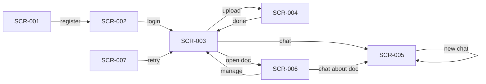
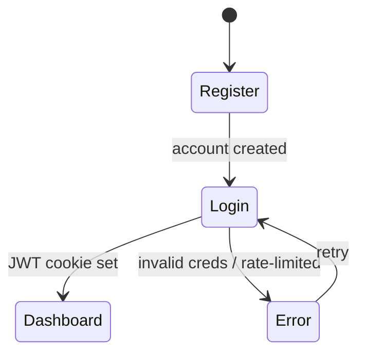
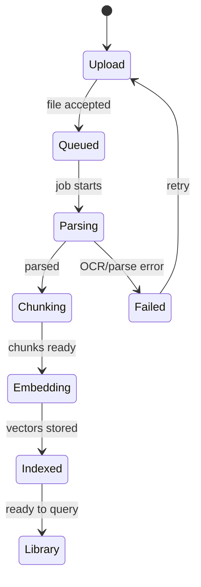
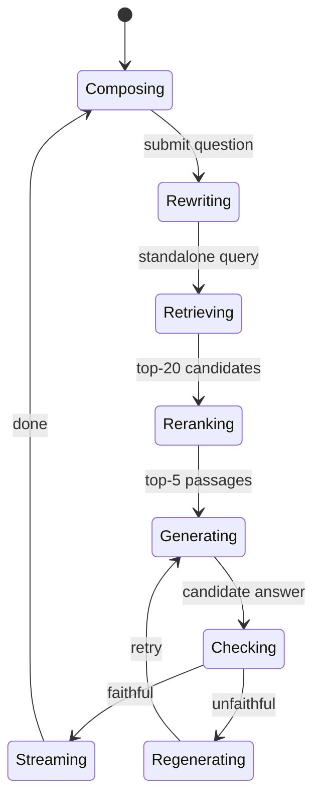

# AppFlow — Veridoc: Application Flow

|Field|Value|
|---|---|
|Version|v0.1|
|Last Updated|2026-08-06|
|Owner|Product Designer|
|Status|Approved|

---

## 1. Screen Inventory

|ID|Screen|Purpose|Entry|Exit|Auth|
|---|---|---|---|---|---|
|SCR-001|Register|Create account|/register|Login|N|
|SCR-002|Login|Authenticate|/login|Dashboard|N|
|SCR-003|Dashboard|Document library|/|Upload, chat|Y|
|SCR-004|Upload / Ingestion|Upload + progress|dashboard|Library|Y|
|SCR-005|Chat|Ask + stream + citations|dashboard|New chat / upload|Y|
|SCR-006|Document Detail|Content + metadata|library|Chat, manage|Y|
|SCR-007|Error / Health Degraded|Dependency down notice|app-wide|Retry|N|

## 2. Navigation Map

## 3. Detailed Flow per Journey

### 3.1 Onboarding

### 3.2 Ingestion

### 3.3 Chat with Citations

## 4. Empty / Loading / Error States

|Screen|Empty|Loading|Error|
|---|---|---|---|
|SCR-003|"Upload your first document" CTA|Skeleton cards|Banner + retry|
|SCR-004|N/A|Progress per stage (parse→chunk→embed→index)|Stage-level failure with retry|
|SCR-005|Empty chat hint|Streaming indicator (typing)|Faithfulness refusal + suggestion|
|SCR-006|"No content"|Skeleton|Banner|
|SCR-007|N/A|Dependency spinner|Which dependency failed, retry|

## 5. Edge Cases & Branching Logic

|IF|THEN|
|---|---|
|Upload > 50MB|Accept but note streaming ingestion (scale item)|
|Unsupported format|Reject with allowed list (PDF/DOCX/TXT)|
|Scanned PDF|OCR fallback path|
|Query with no doc selected|Ask user to pick a document|
|Answer fails faithfulness|Refuse gracefully + regenerate|
|Provider (Ollama) down|Health degraded; UI notice|
|Cross-user document id|403 row-level isolation|

## 6. Notifications & Re-engagement

- In-app: ingestion-complete toast; ingestion-failed toast with retry.
- No email/push in v1.

## 7. Cross-Platform Deltas

- Responsive web only (Next.js). API is platform-agnostic.
- Mobile: chat full-screen; citations open in document panel.

## 8. Related Documents

|Document|Relationship|
|---|---|
|[PRD.md](../product/PRD.md)|Journeys to user stories|
|[Design.md](Design.md)|Components per screen|
|[API.md](../technical/API.md)|Endpoints behind flows|
|[Schema.md](../technical/Schema.md)|Data objects|
