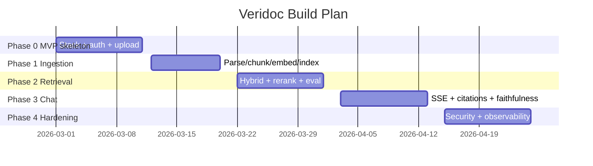
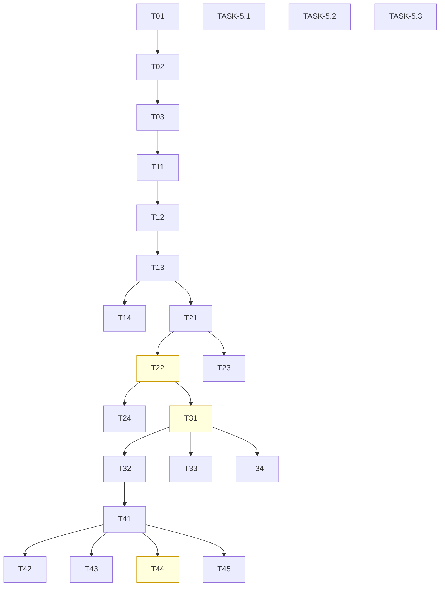

# ImplementationPlan — Veridoc: Phased Build Plan

| Field | Value |
| --- | --- |
| Version | v0.1 |
| Last Updated | 2026-08-06 |
| Owner | Tech Lead |
| Status | Approved |

---

## 1. Build Philosophy

Vertical slices with proof: every phase ships with tests, a working end-to-end journey, and measured numbers (evaluation before/after). Audit-driven hardening (28-point review → 6 bugs → fixed with tests) is the pattern.

## 2. Phase Overview

> Status: Phases 0–4 complete (105+ tests, 8/8 security). Remaining: live eval, demo, scale items — see Tracker.md.

## 3. Phase Breakdown

### Phase 0 — MVP Skeleton (COMPLETE)

**Goal:** Bootable stack with auth + upload. **Exit:** docker compose up; register→login→upload works.

| TASK | Description | Depends | Owner | Effort | Maps to |
| --- | --- | --- | --- | --- | --- |
| TASK-0.1 | Docker compose stack | — | Owner | 2d | REQ-043 |
| TASK-0.2 | JWT auth + rotation | — | Owner | 3d | REQ-030 |
| TASK-0.3 | Upload endpoint + MinIO | TASK-0.2 | Owner | 2d | REQ-001 |

### Phase 1 — Ingestion (COMPLETE)

**Goal:** Docs become queryable. **Exit:** Indexed doc appears in library.

| TASK | Description | Depends | Owner | Effort | Maps to |
| --- | --- | --- | --- | --- | --- |
| TASK-1.1 | Parser (PDF/DOCX/TXT + OCR) | TASK-0.3 | Owner | 3d | REQ-001 |
| TASK-1.2 | Chunker (recursive, boundary-aware) | TASK-1.1 | Owner | 2d | REQ-002 |
| TASK-1.3 | Embedder (MiniLM) | TASK-1.2 | Owner | 2d | REQ-010 |
| TASK-1.4 | ARQ job queue + progress | TASK-1.3 | Owner | 2d | REQ-002 |

### Phase 2 — Retrieval (COMPLETE)

**Goal:** Hybrid precision. **Exit:** Eval shows hybrid > dense.

| TASK | Description | Depends | Owner | Effort | Maps to |
| --- | --- | --- | --- | --- | --- |
| TASK-2.1 | BM25 + dense + RRF | TASK-1.3 | Owner | 3d | REQ-010 |
| TASK-2.2 | Cross-encoder rerank (batched) | TASK-2.1 | Owner | 2d | REQ-011 |
| TASK-2.3 | Query rewriting | TASK-2.1 | Owner | 2d | REQ-012 |
| TASK-2.4 | Eval pipeline (gold 23) | TASK-2.2 | Owner | 3d | PRD §8 |

### Phase 3 — Chat (COMPLETE)

**Goal:** Cited, faithful answers. **Exit:** SSE stream + clickable citations.

| TASK | Description | Depends | Owner | Effort | Maps to |
| --- | --- | --- | --- | --- | --- |
| TASK-3.1 | SSE streaming | TASK-2.2 | Owner | 2d | REQ-020 |
| TASK-3.2 | Citations + viewer jump | TASK-3.1 | Owner | 3d | REQ-021 |
| TASK-3.3 | Multi-turn memory | TASK-3.1 | Owner | 2d | REQ-022 |
| TASK-3.4 | Faithfulness check | TASK-3.1 | Owner | 3d | REQ-023 |

### Phase 4 — Hardening (COMPLETE)

**Goal:** Production readiness. **Exit:** 8/8 security, metrics live.

| TASK | Description | Depends | Owner | Effort | Maps to |
| --- | --- | --- | --- | --- | --- |
| TASK-4.1 | Row-level isolation sweep | TASK-3.2 | Owner | 2d | REQ-031 |
| TASK-4.2 | Fernet encryption | TASK-4.1 | Owner | 2d | REQ-032 |
| TASK-4.3 | Rate limiting | TASK-4.1 | Owner | 1d | REQ-033 |
| TASK-4.4 | Prompt-injection defense + 8 tests | TASK-4.1 | Owner | 3d | REQ-034 |
| TASK-4.5 | structlog + Prometheus + health | TASK-4.1 | Owner | 3d | REQ-041..043 |

### Phase 5 — Completion (OPEN)

**Goal:** Close documented gaps. **Exit:** Live eval numbers + demo.

| TASK | Description | Depends | Owner | Effort | Maps to |
| --- | --- | --- | --- | --- | --- |
| TASK-5.1 | Live 23-question eval on Docker stack | — | Owner | 2d | OQ-01 |
| TASK-5.2 | Demo URL or video | — | Owner | 2d | OQ-02 |
| TASK-5.3 | Persistent BM25 index | — | Owner | 2d | OQ-03 |
| TASK-5.4 | Fix local asyncpg gap | — | Owner | 0.5d | Tracker R-01 |
| TASK-5.5 | Redis query cache | TASK-5.3 | Owner | 2d | Scale list |

## 4. Dependency Graph

## 5. Environment & Tooling Setup Checklist

- [ ] Docker + Compose installed
- [ ] `cp .env.example .env`; set `JWT_SECRET` + `FILE_ENCRYPTION_KEY` (secrets.token_hex(32))
- [ ] `docker compose up --build`
- [ ] Manual dev: backend venv + `uvicorn app.main:app --reload`; frontend `npm run dev`
- [ ] Verify `/api/v1/health` reports all deps OK
- [ ] `make lint && make test` (add `asyncpg` to requirements — TASK-5.4)

## 6. Rollout Strategy

- LLM provider via env var (OLLAMA base vs Claude/OpenAI key) — no code change.
- Feature flags: none in v1; toggle via env (e.g., FAITHFULNESS_CHECK_ENABLED).
- Migrations before deploy; rollback = Alembic downgrade.

## 7. Definition of Done (global)

- [ ] Tests pass (pytest + frontend); CI green
- [ ] Security suite green (8/8)
- [ ] Docs updated (Schema.md/../technical/API.md if changed)
- [ ] Accessibility checked (UI tasks)
- [ ] Tracker.md updated
- [ ] PR ≤ 400 lines unless justified

## 8. Related Documents

| Document | Relationship |
| --- | --- |
| [PRD.md](../product/PRD.md) | REQ IDs traced |
| [AppFlow.md](../design/AppFlow.md) | SCR IDs traced |
| [Schema.md](../technical/Schema.md) | TBL IDs traced |
| [Tracker.md](Tracker.md) | Live status |
