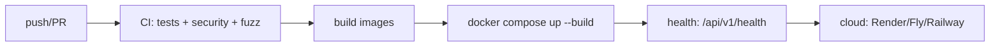
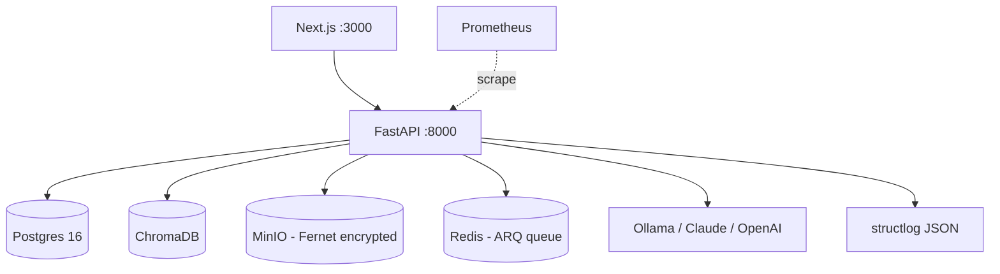

# Deployment — Veridoc: Deployment Guide

| Field | Value |
| --- | --- |
| Version | v0.1 |
| Last Updated | 2026-08-06 |
| Owner | DevOps Engineer |
| Status | Approved |

---

## 1. CI/CD Pipeline

## 2. Environment Promotion

| Stage | Trigger | Verification |
| --- | --- | --- |
| Dev | manual | npm run dev + uvicorn |
| CI | PR/merge | full test suite + security |
| Prod demo | docker compose up --build | health + sample Q&A |
| Cloud | docs/../reference/deployment-runbook.md | copy-paste runbooks |

## 3. Deployment Topology

- One command: `docker compose up --build`; HEALTHCHECK on every service.
- `.env.example` → `.env`; must set `JWT_SECRET` + `FILE_ENCRYPTION_KEY`.
- LLM provider: `OLLAMA_BASE_URL` default; swap to Claude/OpenAI via env var.
- Data volumes: uploads (MinIO), vector store (Chroma), DB (Postgres).

## 4. Rollback Procedure

1. Identify bad release (health failure, metrics, faithfulness regression).
2. Redeploy previous image tag.
3. Alembic downgrade if schema changed.
4. Re-index documents if ingestion broke.
5. Verify health + sample Q&A with citations.
6. Log rollback in ../project/Tracker.md changelog.

## 5. Feature Flag / Env Policy

| Env var | Default | Purpose |
| --- | --- | --- |
| LLM_PROVIDER | ollama | Provider switch |
| FAITHFULNESS_CHECK_ENABLED | true | Gate toggle |
| JWT_SECRET / FILE_ENCRYPTION_KEY | (unset → fail-fast) | Required secrets |

## 6. On-Call / Runbook — docs/../reference/deployment-runbook.md

- **Health fails on LLM** → check Ollama running / API key validity.
- **Ingestion stuck** → inspect ARQ queue depth; retry jobs.
- **Faithfulness rejections spike** → check retrieval quality (rerank top-k).
- **High P95 latency** → batch rerank, Redis query cache (scale list).
- **Cloud deploy** → follow runbook for Render/Fly/Railway.

## 7. Scale Paths (documented)

1. ChromaDB → Qdrant/Pinecone.
2. Persistent BM25 index (drop ~500ms warmup).
3. Redis query cache.
4. vLLM/TGI for 5–10x faster generation.
5. Pipeline parallelization.
6. Streaming ingestion for files > 50MB.

## 8. Related Documents

| Document | Relationship |
| --- | --- |
| [TechSpec.md](TechSpec.md) | Environments matrix |
| [API.md](API.md) | Health endpoint |
| [SecurityAndCompliance.md](SecurityAndCompliance.md) | Incident response |
| [ImplementationPlan.md](../project/ImplementationPlan.md) | TASK-5.x |
