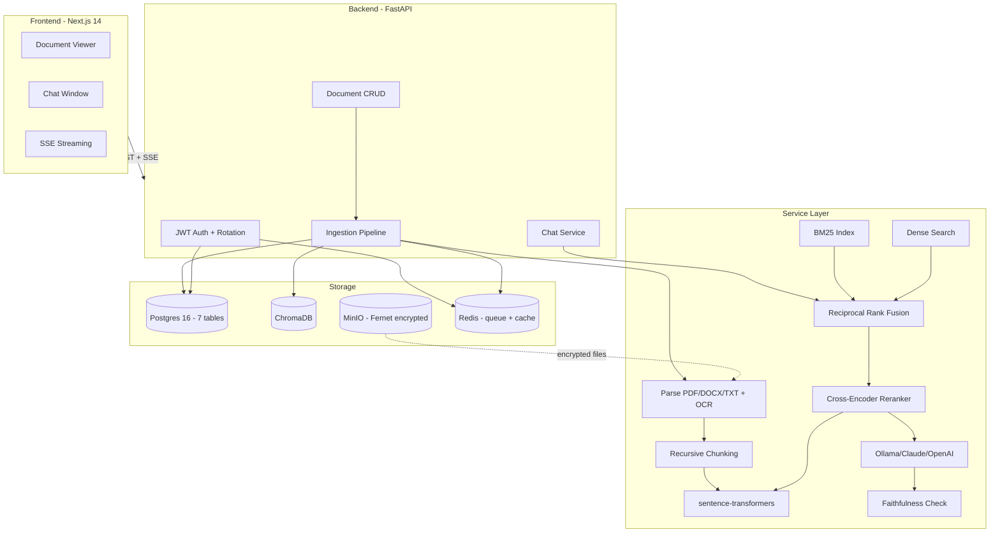
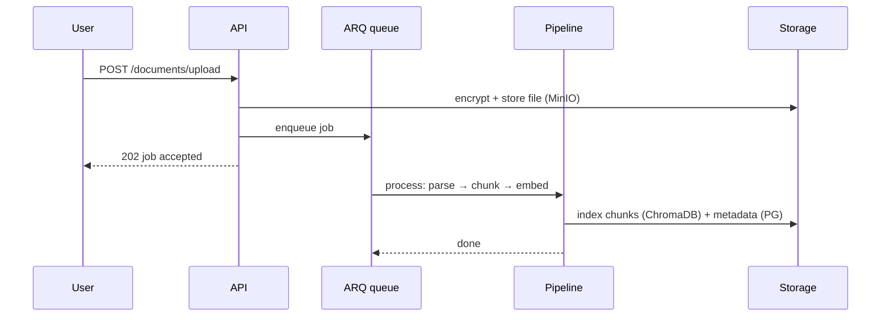
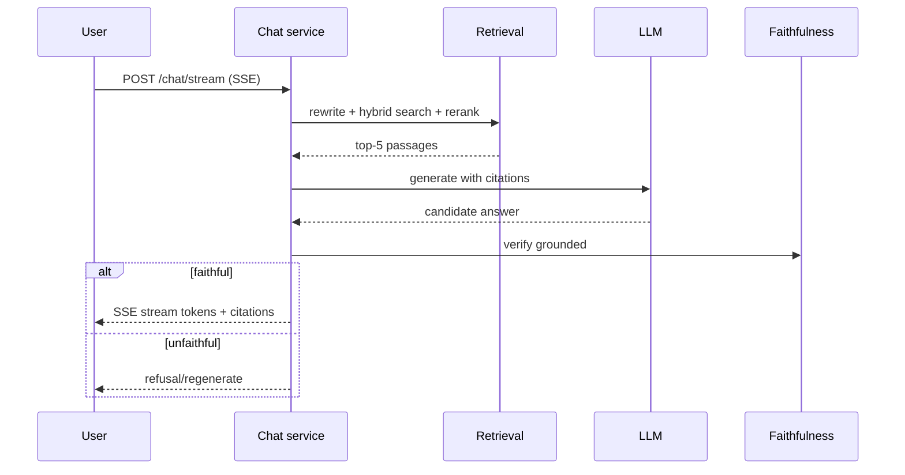

# TechSpec — Veridoc: Technical Specification

| Field | Value |
| --- | --- |
| Version | v0.1 |
| Last Updated | 2026-08-06 |
| Owner | Staff Engineer |
| Status | Approved |

---

## 1. Architecture Overview

## 2. Tech Stack Table

| Layer | Technology | Version | Justification |
| --- | --- | --- | --- |
| Backend | Python + FastAPI | 3.12 / ≥ 0.110 | Async-native, SSE, auto OpenAPI |
| ORM | SQLAlchemy + Alembic + Pydantic v2 | 2.x | Typed, migrations, validation |
| Frontend | Next.js 14 + TypeScript + Tailwind + Zustand | 14 | App Router, streaming UX |
| Vector DB | ChromaDB | latest | Local-first, file-persisted |
| Database | PostgreSQL | 16 | ACID; 7 normalized tables + GIN tsvector |
| LLM | Ollama (default) / Claude / OpenAI | — | Pluggable via single env var |
| Embeddings | all-MiniLM-L6-v2 | 384-dim | CPU-friendly, no API key |
| Reranker | ms-marco-MiniLM-L-6-v2 | — | Batched (2.1x speedup) |
| Search | rank-bm25 + dense + RRF | — | Hybrid precision |
| OCR | Tesseract (pytesseract) | — | Scanned PDF fallback, local |
| Queue | ARQ + Redis | — | Durable jobs, retry + backoff |
| Object store | MinIO | — | Encrypted file storage (S3-compatible) |
| Observability | Prometheus + structlog | — | /metrics + correlation IDs |
| Container | Docker + Compose | — | One-command stack, HEALTHCHECKs |

## 3. System Components

| Component | Responsibility | Inputs/Outputs | Scaling | Failure Modes |
| --- | --- | --- | --- | --- |
| Auth service | Register/login, JWT rotation | creds → tokens | Stateless | DB down → fail closed |
| Ingestion pipeline | Parse → chunk → embed → index | file → chunks in Chroma + metadata in PG | ARQ workers | Retry + exponential backoff |
| Retrieval (5 modules) | BM25, dense, RRF, rerank | query → top-5 passages | In-process | BM25 rebuild ~500ms warmup (OQ-03) |
| Chat service | Rewrite → retrieve → generate → check | msg → SSE stream | Vertical | Faithfulness gate rejects |
| LLM provider | Generate answers | prompt → text | External/local | Provider down → health degrades |
| DI container | Constructor injection | config → services | — | Miswiring caught by tests |

## 4. Data Flow Diagrams

### 4.1 Ingestion

### 4.2 Chat Query

## 5. Third-Party Integrations

| Service | Purpose | Failure Fallback | Cost | Rate Limits |
| --- | --- | --- | --- | --- |
| Ollama | Local LLM | Claude/OpenAI env switch | Free (local) | HW-bound |
| Claude/OpenAI | Optional LLM | Ollama default | Pay-per-token | Provider |
| MinIO | Object storage | Local disk (S3-compatible) | Free | None |
| ChromaDB | Vector store | Re-index | Free | None |
| Tesseract | OCR | Non-OCR path | Free | None |

## 6. Non-Functional Requirements

| Category | Requirement | Target | How Verified |
| --- | --- | --- | --- |
| Performance | Rerank latency batch=20 | ≤ 130 ms | Benchmark |
| Performance | p95 end-to-end answer | ≤ 16 s (measured 15.8s) | Eval pipeline |
| Reliability | Faithfulness gate | 100% answers verified | LLM-as-judge |
| Availability | Stack uptime | ≥ 99.5% | Health probes |
| Security | Red-team tests | 8/8 | Security suite |
| Scalability | Ingestion throughput | Async queue, retry/backoff | Load test (Locust) |

## 7. Environments

| Env | URL Pattern | Data | Deploy | Access |
| --- | --- | --- | --- | --- |
| Dev | localhost:3000 / :8000 | Local uploads | npm run dev + uvicorn | Local |
| CI | ephemeral | Testcontainers PG + Chroma | GitHub Actions | CI |
| Prod demo | docker compose up --build | Local volumes | Compose | Local |
| Cloud (docs/../reference/deployment-runbook.md) | Render/Fly/Railway | Managed PG/MinIO | Per runbook | Deployer |

## 8. Error Handling Strategy

- Global envelope `{items, total, limit, offset}` for lists; typed error codes on others.
- ARQ jobs: retry + exponential backoff; dead-letter visibility.
- Faithfulness gate: rejected answers trigger regenerate/refusal rather than display.
- Health endpoint pings PG, Chroma, MinIO, LLM — degraded state surfaced to UI.
- Startup fail-fast: refuses to boot with empty/placeholder secrets.

## 9. Observability

- Prometheus `/metrics`: request count, latency histograms, error rates.
- structlog JSON with correlation IDs (request, user, conversation).
- Health: `/api/v1/health` (Postgres, ChromaDB, MinIO, LLM).
- Dashboards: request rate, latency, ingestion queue depth, faithfulness reject rate.

## 10. Technical Risks & Mitigations

| Risk | Mitigation |
| --- | --- |
| ChromaDB scaling ceiling | Documented Qdrant/Pinecone path (scale list) |
| BM25 warmup rebuild | OQ-03 persistent index |
| Local env dep gaps (asyncpg) | Add to requirements; CI unaffected (Tracker R-01) |
| LLM output XSS | CSP + rehype-sanitize on LLM output |
| Prompt injection | `<retrieved_context>` boundary + 8/8 tests |

## 11. Related Documents

| Document | Relationship |
| --- | --- |
| [PRD.md](../product/PRD.md) | Requirements implemented |
| [Schema.md](Schema.md) | 7-table model |
| [API.md](API.md) | Endpoint contracts |
| [SecurityAndCompliance.md](SecurityAndCompliance.md) | Security architecture |
| [Deployment.md](Deployment.md) | Docker + cloud runbooks |
| [Testing.md](Testing.md) | Verification |
